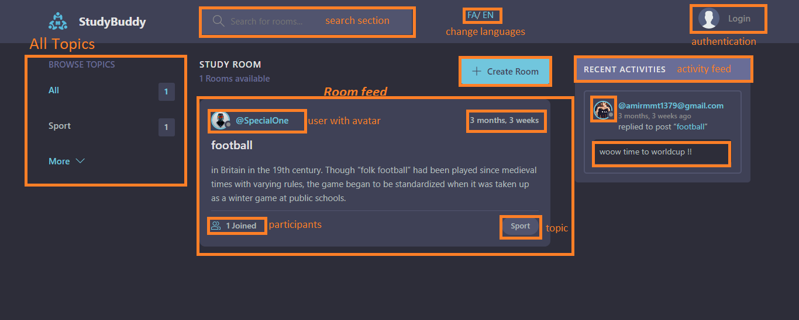

# django-Study-Platform (StudyBoom)

### :hammer_and_wrench: Languages and Tools :
 &nbsp;
  &nbsp;
   &nbsp;
     &nbsp;
  &nbsp;
---

pip install -r requirements.txt

Projects contains :
- Two Languages(En/FA)
- Api app
- Account app for users

Each user can :
- Create room in certain topic
- Join other user's room
- Write message in the rooms

<h2>Home page</h2>

<h2>Room page</h2>

<h2>Auth</h2>

<h2>Profile</h2>

<h2>Topics</h2>

